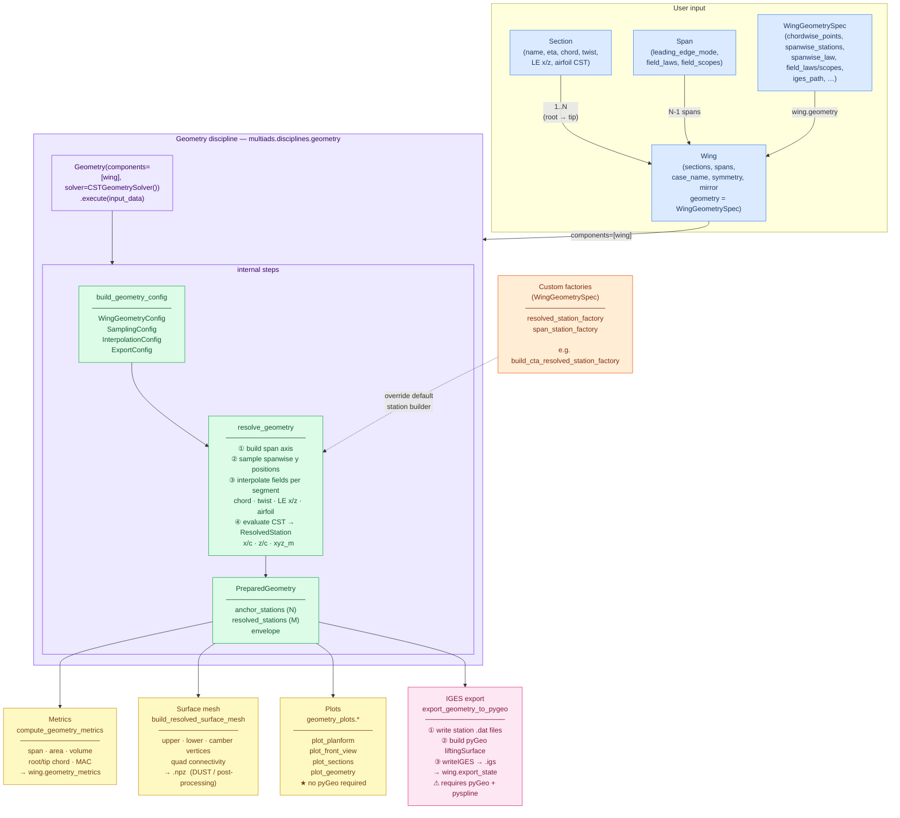

# Wing Geometry — Workflow

---

## Step-by-step summary

| Step | What happens | Key object |
|---|---|---|
| **1. Define sections** | Each `Section` fixes one spanwise anchor: chord, twist, LE position, airfoil shape (CST) | `Section` |
| **2. Define spans** | Each `Span` says how to interpolate between the two sections it connects (law, scope, LE mode) | `Span` |
| **3. Attach spec** | `WingGeometrySpec` on `wing.geometry` controls sampling density, default laws, and export paths | `WingGeometrySpec` |
| **4. Execute discipline** | `Geometry(components=[wing], solver=CSTGeometrySolver()).execute(input_data)` — this is the single public entry point | `Geometry` |
| **4a. (internal) Build config** | `build_geometry_config` translates the spec into internal sub-configs | `WingGeometryConfig` |
| **4b. (internal) Resolve** | `resolve_geometry` samples the span, interpolates every field per segment, evaluates each CST section in 3-D | `PreparedGeometry` |
| **6a. Metrics** | `compute_geometry_metrics` integrates span, area, MAC, volume from the resolved stations | `GeometryMetricSet` |
| **6b. Mesh** | `build_resolved_surface_mesh` assembles structured upper/lower/camber grids + quad connectivity | `ResolvedSurfaceMesh` |
| **6c. Plots** | `geometry_plots.*` draws planform, front view, sections — matplotlib only, no pyGeo | PNG / interactive |
| **6d. IGES** | `export_geometry_to_pygeo` feeds the stations into pyGeo and calls `writeIGES` | `.igs` file |

Steps 6a–6d are all independent — you can use any combination.

The **Geometry discipline** (`multiads.disciplines.geometry.Geometry`) is the single public entry point — it wraps config build, resolution and export into a GEMSEO-compatible block so the same wing can be driven by an optimiser or a DOE loop without changing the geometry code. Steps 6a–6d are all independent — you can use any combination after execution.
